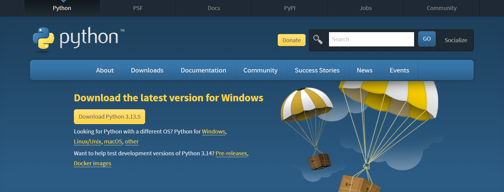
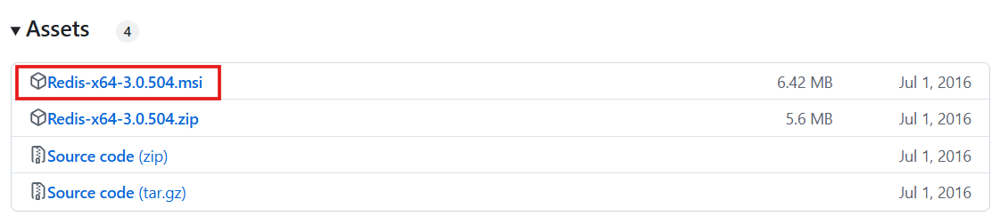
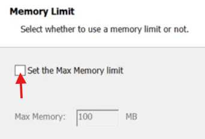
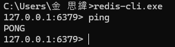
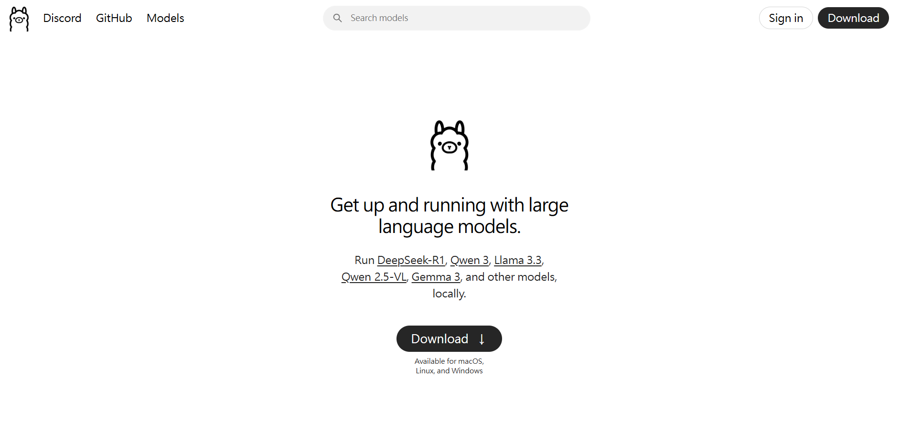
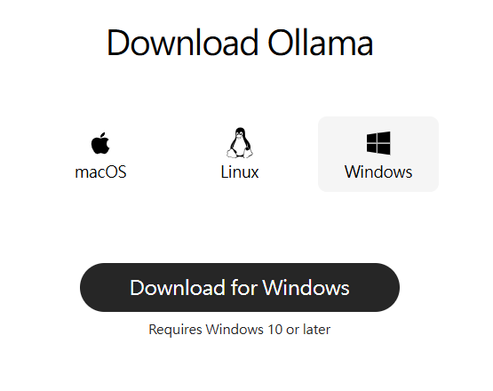
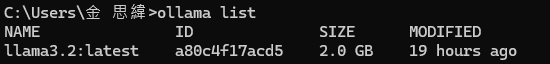

# 基於 RAG 架構的智慧文件問答系統

-----

## 專案簡介

這個專案旨在打造一個智能問答系統，其核心是 **Retrieval-Augmented Generation (RAG)** 架構。它讓使用者能夠上傳 PDF、TXT、DOCX 等文件，系統會自動處理這些文件，並透過本地部署的大型語言模型 (LLM) 回答與文件內容相關的問題。

-----

## 解決的問題

  * **提升資訊檢索效率**：快速從大量非結構化文件中提取準確資訊。
  * **減少 LLM「幻覺」**：透過從特定文件中檢索內容，確保 LLM 的回答有事實依據，避免產生不真實的資訊。
  * **擴展 LLM 知識邊界**：彌補 LLM 訓練數據的局限性，使其能運用最新或專有領域的文件知識進行問答。

-----

## 技術棧

  * **後端框架**：Django, Django REST Framework (DRF)
  * **非同步任務**：Celery
  * **訊息代理/結果儲存**：Redis
  * **文件解析**：`pypdf`, `python-docx`
  * **AI 核心**：
      * `langchain`: LLM/向量資料庫整合框架
      * `sentence-transformers`: 生成文本嵌入 (Embeddings)
      * `chromadb`: 輕量級持久化向量資料庫
      * `ollama`: 本地運行 LLM (例如 Llama 3.2)
  * **前端**：HTML/JavaScript (Django Template)

-----

## 核心功能

  * **多格式文件上傳**：支援 PDF, TXT, DOCX 等常見文件格式。
  * **文件非同步處理**：利用 **Celery** 在後台執行耗時的文件解析、分塊、嵌入與向量索引建立，確保前端界面流暢不卡頓。
  * **狀態追蹤**：前端實時顯示文件處理和問答任務的進度。
  * **RAG 智能問答**：
      * **檢索 (Retrieval)**：根據用戶問題，從相關文件中精準檢索內容片段。
      * **生成 (Generation)**：將檢索到的內容作為上下文，提供給 LLM 生成精確、有根據的答案。
  * **問答歷史管理**：保存每次提問與回答的記錄，並顯示答案的參考來源。
  * **文件及對話記錄刪除**：提供介面刪除已上傳的文件及其所有相關對話紀錄，或單獨刪除某條對話紀錄。

-----

## 安裝與運行指南

在開始之前，請確保您的系統已滿足所有前置條件。

### 1\. 前置條件與安裝

#### 1.1 安裝 Python

確保您的系統已安裝 **Python 3.9+**。您可以從 [Python 官網](https://www.python.org/downloads/) 下載並安裝。



#### 1.2 安裝並啟動 Redis 服務

Redis 將作為 Celery 的 Broker (訊息代理) 和 Backend (結果儲存)。

  * **Windows**：
      1. 至 [redis官方github](https://github.com/MicrosoftArchive/redis/releases)
      2. 選擇 `.msi` 檔下載
      
      3. Redis 內的資料是存在記憶體，如果不注意可能會佔用太多空間，所以在安裝時建議設置記憶體上限
      
---
  * **macOS (使用 Homebrew)**：

    ```bash
    brew install redis
    brew services start redis # 啟動服務
    ```
---
  * **Linux (以 Debian/Ubuntu 為例)**：

    ```bash
    sudo apt update
    sudo apt install redis-server
    sudo systemctl enable redis-server # 設定開機自啟動
    sudo systemctl start redis-server  # 啟動服務
    ```
---

* 測試安裝
1. 第一次啟用: 打開命令字元，輸入
      ```bash
      redis-cli.exe
      ```
2. 輸入的開頭會變成
     ```bash
     127.0.0.1:6379>
     ```
3. 下指令測試，如果回應 `PONG` 代表安裝成功
     ```bash
     ping
     ```

    

#### 1.3 安裝並啟動 Ollama

Ollama 是一個輕量級的框架，用於在本地運行大型語言模型。

1.  **下載並安裝 Ollama**：
    前往 [Ollama 官網](https://ollama.com/download) 下載適用於您作業系統的安裝程式並進行安裝。

    
    

2.  **下載 Llama 3.2 模型**：
    開啟一個新的終端機 (或 PowerShell)，運行以下命令下載 Llama 3.2 模型 (如果模型名稱不同，請替換)：

    ```bash
    ollama run llama3.2
    ```

      * 首次運行此命令時，Ollama 會自動下載 `llama3.2` 模型。這可能需要一些時間，具體取決於您的網路速度和模型大小。
      * 下載完成後，模型會自動啟動，您可以輸入一些文字與之互動，確認其正常工作。輸入 `/bye` 或按 `Ctrl+D` 退出互動模式。

    

3.  **確認模型列表** (可選)：
    您可以運行以下命令查看所有已下載的模型：

    ```bash
    ollama list
    ```
    

### 2\. 專案環境設定

#### 2.1 克隆專案

如果您是從 GitHub 下載專案，請在終端機中執行：

```bash
git clone https://github.com/szweijin/rag-document-qa-system.git
cd rag-document-qa-system
```

[貼圖：`git clone` 執行截圖]

#### 2.2 建立並啟用虛擬環境

為避免套件衝突，強烈建議為專案建立獨立的 Python 虛擬環境。

1.  **建立虛擬環境**：

    ```bash
    python -m venv venv
    ```

2.  **啟用虛擬環境**：

      * **macOS / Linux**：
        ```bash
        source venv/bin/activate
        ```
      * **Windows (PowerShell)**：
        ```bash
        .\venv\Scripts\activate
        ```

    啟用成功後，您的終端機提示符前會顯示 `(venv)` 字樣。

[貼圖：建立及啟用虛擬環境截圖]

#### 2.3 生成並安裝 Python 套件

為了讓其他開發者或您自己在不同環境下也能輕鬆部署，我們需要一個 `requirements.txt` 文件。

1.  **安裝專案所需的所有 Python 套件**：
    如果您是首次設定，請手動安裝所有必要的套件。

    ```bash
    pip install Django djangorestframework celery pillow pypdf python-docx langchain langchain-community sentence-transformers chromadb
    ```

    **注意**：`langchain` 的版本更新頻繁，可能會導致兼容性問題。如果遇到錯誤，可以嘗試鎖定版本，例如 `langchain==0.1.0`。

    [貼圖：`pip install` 執行截圖]

2.  **生成 `requirements.txt` 文件**：
    在虛擬環境中，執行以下命令。這會將您環境中安裝的所有套件及其精確版本寫入到 `requirements.txt` 中。

    ```bash
    pip freeze > requirements.txt
    ```

    **請將此文件與您的程式碼一同提交到 Git 儲存庫。**

    [貼圖：`pip freeze > requirements.txt` 執行截圖]

3.  **供後續使用 (`pip install -r requirements.txt`)**：
    之後，其他用戶只需在啟用虛擬環境後運行 `pip install -r requirements.txt` 即可安裝所有依賴。

#### 2.4 配置 `.gitignore`

`.gitignore` 文件用於指定 Git 應忽略的文件或目錄，不將它們納入版本控制。這對於虛擬環境、資料庫文件、用戶上傳的媒體文件和 AI 模型數據等非常重要。

1.  **在專案根目錄 (與 `manage.py` 同級) 創建 `.gitignore` 文件**。

2.  **將以下內容複製並粘貼到 `.gitignore` 文件中**：

    ```gitignore
    # Python
    __pycache__/
    *.pyc
    *.egg-info/
    .pytest_cache/
    .venv/
    venv/ # 虛擬環境

    # Django
    *.log
    local_settings.py
    db.sqlite3 # SQLite 資料庫文件
    media/ # 用戶上傳的文件，不應版本控制

    # Celery / Redis
    celerybeat.pid
    celeryd.pid

    # AI / ChromaDB
    chroma_db/ # ChromaDB 持久化資料夾，非常重要，絕對不要上傳這個
    .env # 環境變量文件 (如果使用 dotenv 管理敏感信息)

    # IDEs
    .idea/ # PyCharm
    .vscode/ # VS Code

    # Operating System Files
    .DS_Store
    Thumbs.db
    ```

3.  **保存 `.gitignore` 文件**。

[貼圖：`.gitignore` 文件內容及位於專案根目錄的截圖]

#### 2.5 執行資料庫遷移

這會創建 Django 應用程式所需的所有資料表。

```bash
python manage.py makemigrations
python manage.py migrate
```

[貼圖：`makemigrations` 和 `migrate` 執行截圖]

### 3\. 運行服務

現在，所有準備工作已就緒，可以啟動 Django 伺服器和 Celery Worker 了。

#### 3.1 啟動 Django 開發伺服器

這個伺服器負責處理 Web 請求並提供前端界面和 API。

1.  **開啟第一個終端機 (建議以管理員身份執行)**。

2.  **導航到專案根目錄並啟用虛擬環境**。

3.  **運行伺服器**：

    ```bash
    python manage.py runserver
    ```

    您將看到類似 `Starting development server at http://127.0.0.1:8000/` 的輸出。

    [貼圖：`python manage.py runserver` 執行截圖]

4.  **訪問前端介面**：
    在您的瀏覽器中打開 `http://127.0.0.1:8000/`。

    [貼圖：瀏覽器中打開的應用程式首頁截圖]

#### 3.2 啟動 Celery Worker

Celery Worker 負責處理所有耗時的後台任務，例如文件解析、向量化和 LLM 問答。

1.  **開啟第二個終端機 (建議以管理員身份執行)**。

2.  **導航到專案根目錄並啟用虛擬環境**。

3.  **啟動 Celery Worker**：

    ```bash
    celery -A rag_qa_project worker -l info --pool=solo
    ```

      * **`--pool=solo` 參數非常重要**，尤其是在 Windows 環境下。它會強制 Celery Worker 以單進程模式運行，避免多進程導致的文件鎖定（`PermissionError`）問題，特別是當 ChromaDB (內部使用 SQLite) 進行持久化操作時。
      * 您將看到 Celery Worker 的啟動訊息。

    [貼圖：`celery -A rag_qa_project worker -l info --pool=solo` 執行截圖]

-----

## DEMO 演示

現在您可以體驗智慧文件問答系統了！

1.  **開啟瀏覽器**：確保您正在訪問 `http://127.0.0.1:8000/`。

2.  **上傳文件**：

      * 在「文件上傳」區塊，點擊「選擇文件」按鈕。
      * 選擇一個 PDF、TXT 或 DOCX 文件。
      * 點擊「上傳文件」按鈕。

    [貼圖：文件上傳界面截圖]

3.  **觀察文件處理進度**：

      * 上傳後，文件將顯示在「已處理文件」列表下方。
      * 文件狀態將從「已上傳」變為「處理中」，最終變為「已完成」。
      * 您也可以點擊「刷新文件列表」按鈕手動更新狀態，或等待每 5 秒的自動刷新。
      * 在 Celery Worker 的終端機中，您會看到文件解析、分塊、嵌入和向量化過程的詳細日誌。

    [貼圖：文件處理狀態（例如從處理中到已完成）的截圖]
    [貼圖：Celery Worker 處理文件日誌的截圖]

4.  **提出問題**：

      * 當選定的文件狀態為「已完成」時，下方的「提出問題」文本框將被啟用。
      * 在文本框中輸入一個與您上傳文件內容相關的問題。
      * 點擊「提問」按鈕。

    [貼圖：提問界面截圖]

5.  **查看答案與參考來源**：

      * 問題提交後，會顯示在「問答歷史」區塊。初始狀態可能顯示為「待處理」或「回答中」。
      * 在 Celery Worker 終端機中，您會看到 LLM 檢索和生成答案的日誌。
      * 等待幾秒後，答案和相關的參考來源（標註文件名和頁碼）會自動顯示在問答歷史中。

    [貼圖：問答結果及參考來源顯示截圖]

6.  **刪除文件**：

      * 在「已處理文件」區塊，從下拉選單中選擇一個文件。
      * 點擊「刪除選取文件」按鈕，並確認彈窗提示。
      * 該文件及其所有相關的對話紀錄、ChromaDB 向量索引和物理文件都將被刪除。文件列表會自動刷新。

    [貼圖：刪除文件按鈕及確認彈窗截圖]

7.  **刪除單條對話紀錄**：

      * 在「問答歷史」區塊，每條對話紀錄下方都有一個「刪除此對話」按鈕。
      * 點擊此按鈕並確認彈窗提示。
      * 該條對話紀錄將被刪除，問答歷史會自動刷新。

    [貼圖：刪除單條對話紀錄按鈕及確認彈窗截圖]

-----

## 專案亮點

  * **Celery 異步處理**：將耗時的 AI 任務卸載至後台，保證 Web 應用響應流暢。
  * **RAG 架構的實際應用**：清晰展示了如何結合檢索與生成，為 LLM 提供精確的上下文，實現可信賴的問答。
  * **本地 LLM 支持**：透過 **Ollama** 實現本地模型運行，提高數據隱私性並降低對外部 API 的依賴。
  * **模組化設計**：Django 模型、DRF API 和 Celery 任務分離，便於維護和擴展。
  * **用戶友好界面**：提供文件上傳、進度追蹤、問答及刪除功能，操作直觀。

-----

## 注意事項

  * **本地 LLM 資源需求**：運行大型語言模型需要足夠的 CPU/RAM 資源，若需更高性能可能需要支援 CUDA 的 GPU。
  * **文件編碼**：對於 TXT 文件，請確保使用 UTF-8 編碼以避免讀取錯誤。
  * **ChromaDB 持久化**：`chroma_db/` 資料夾會自動在專案根目錄生成，用於儲存向量資料。在將專案提交到 Git 儲存庫時，請務必透過 `.gitignore` 忽略此資料夾。

-----

## 未來可擴展性

  * **更多文件類型支援**：整合更多解析器，支持 Markdown, CSV, 圖片 (OCR) 等。
  * **高級 RAG 策略**：探索多階段檢索、重排序、查詢擴展等技術，進一步優化回答質量。
  * **實時通知**：使用 Django Channels 實現文件處理和問答結果的實時推送，而非簡單的輪詢。
  * **使用者管理**：導入用戶認證與文件權限控制，實現多用戶模式。
  * **前端框架升級**：採用 React/Vue/Angular 等現代前端框架，構建更具交互性和豐富的用戶體驗。

-----